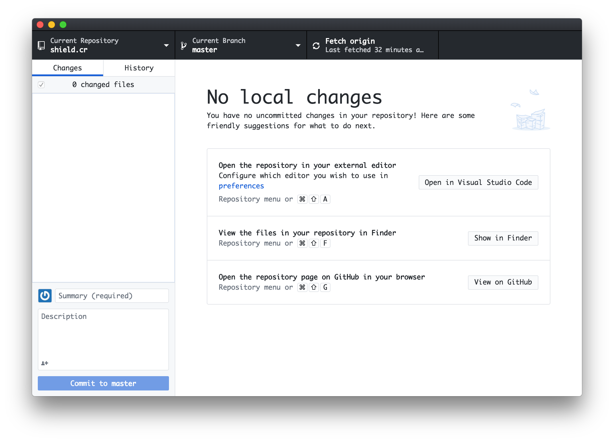
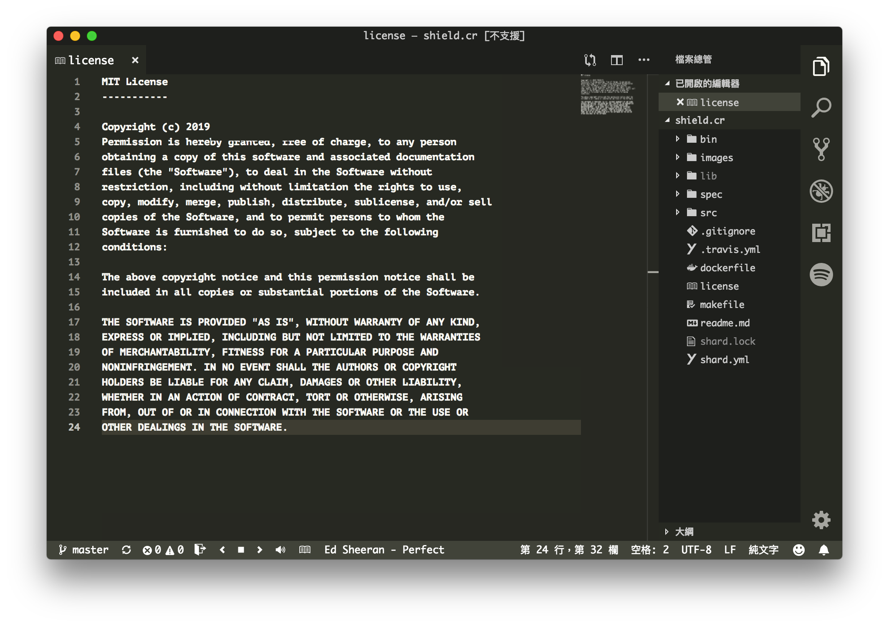

<div align = "center"></div>

<div align = "center">
  <h1>Bottle.cr - Application UI Patcher</h1>
</div>

<p align="center">
  <a href="https://crystal-lang.org">
    </a>
  <a href="https://github.com/636f7374/coffee.cr/actions">
    </a>
  <a href="https://github.com/73686f77/bottle.cr/releases">
    </a>
  <a href="https://github.com/73686f77/bottle.cr/blob/master/license">
  	</a>
</p>

<div align = "center"></a></div>
<div align = "center"></a></div>

## Description

* Some fonts, style adjustments.

### Supports

* [X] Visual Studio Code
  * Container Font
  * Sidebar Font
  * Sidebar Upcase
  * Input Container
  * LabelName Font
* [X] Github Desktop
  * Container Font
  * Client Font
  * CodeMirror Font
* [ ] ...

## Directory

* Visual Studio Code (macOS) | `bottle vscode`
  * /Applications/Visual Studio Code.app/Contents/Resources/app/out/vs/workbench
  * /Applications/Visual Studio Code.app/Contents/Resources/app/out/vs/workbench/contrib/webview/browser/pre
* Github Desktop (macOS) | `bottle github`
  * /Applications/GitHub Desktop.app/Contents/Resources/app

## Tips

* Since this repository is not the first priority, I will temporarily archive it.

## Use Bottle

### Used as Shard

Add this to your application's shard.yml:

```yaml
dependencies:
  bottle:
    github: 73686f77/bottle.cr
```

### Installation

```bash
$ git clone https://github.com/73686f77/bottle.cr.git
$ cd bottle.cr && make build && make install
```

## Credit

* [\_Icon::freepik/magic](https://www.flaticon.com/packs/magic-13)

## Contributors

|Name|Creator|Maintainer|Contributor|
|:---:|:---:|:---:|:---:|
|**[73686f77](https://github.com/73686f77)**|√|√||

## License

* MIT License
